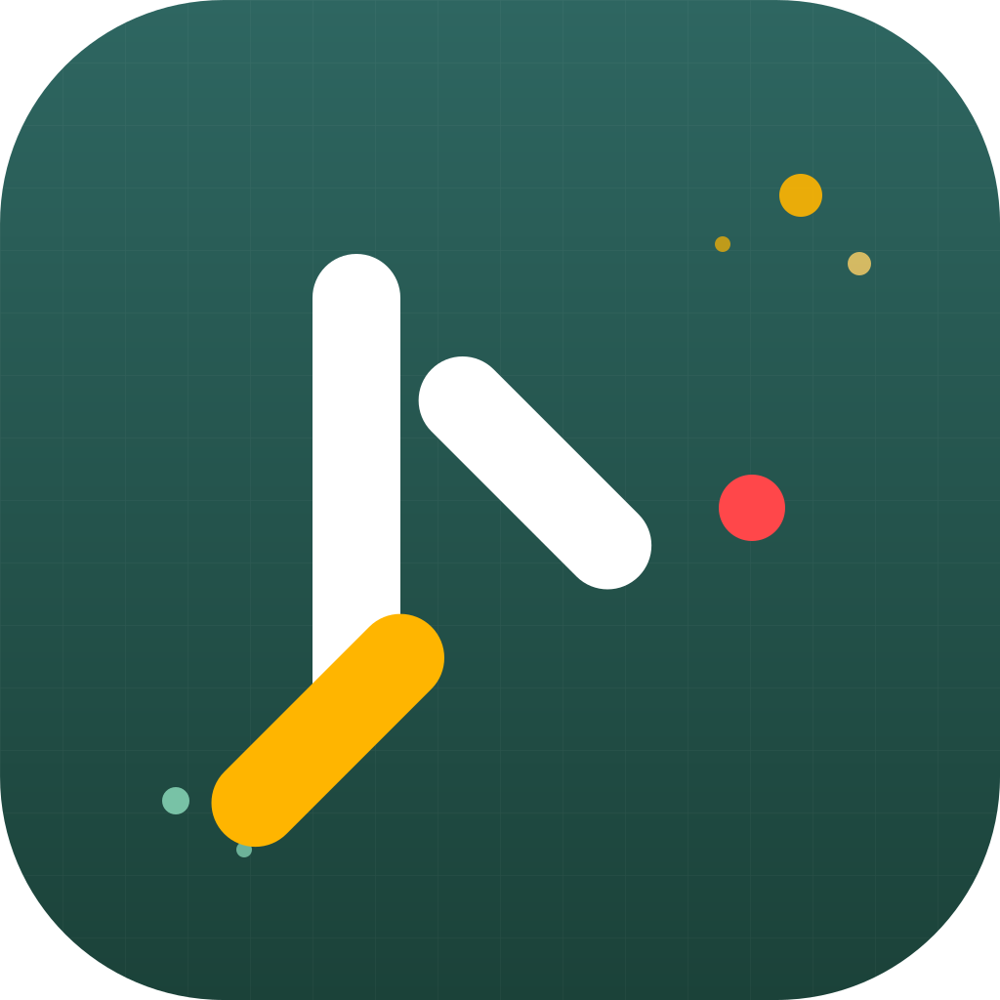

# KindWorks Usage — Org Dashboard for Claude

A KindWorks.AI-branded desktop app (macOS) and web dashboard to monitor Claude API usage, cost, and spend limits across every member of your organization.



## What you get

- **Spend overview** — MTD spend vs monthly limit with color-coded progress (green → yellow → coral)
- **Key insights** — top model, top spender, avg daily spend, projected monthly cost
- **Usage trends** — daily spend chart, model breakdown, distribution pie
- **Member table** — per-user MTD spend, tokens used, budget utilization
- **Date range** — Month to Date · Last 30 Days · Last 7 Days
- **Branded** — full KindWorks.AI design system (green grid, yellow dots, pill shapes, Jeko/DM Sans typography)

---

## Option 1 — Install the Mac app (recommended for end users)

### Download

Grab the latest `.dmg` from the [Releases page](https://github.com/dlozano-ai/dlozano-ai/releases) (or build it yourself — see below).

### Install

1. Open `KindWorks Usage-<version>-universal.dmg`
2. Drag **KindWorks Usage** into the Applications folder
3. Launch it from Applications or Spotlight

On first launch, macOS may warn the app is from an "unidentified developer" (because the build isn't signed with an Apple Developer ID yet). To allow it:

- Right-click the app in Applications → **Open** → **Open**

The app will then launch normally for future uses.

### Use

1. Paste your **Anthropic Admin API key** (starts with `sk-ant-admin-...`) — get one at [console.anthropic.com/settings/admin-keys](https://console.anthropic.com/settings/admin-keys)
2. Click **Connect**
3. Dashboard loads your org's usage

Your key is stored only in the app's local storage — never transmitted anywhere except Anthropic's own API.

---

## Option 2 — Run the web dashboard locally

For development or if you prefer a browser tab:

```bash
git clone https://github.com/dlozano-ai/dlozano-ai.git
cd dlozano-ai
git checkout claude/org-usage-dashboard-SdTLM
npm install
npm run dev
```

Open [http://localhost:3000](http://localhost:3000).

---

## Building the Mac app yourself

Requires macOS with Node.js 20+ installed.

```bash
# one-time setup
npm install

# regenerate the app icon from build/icon.svg
npm run build:icon

# build the universal .dmg (arm64 + x64)
npm run pack:mac
```

Output lands in `dist-electron/`:
- `KindWorks Usage-0.1.0-universal.dmg` — installer
- `KindWorks Usage-0.1.0-universal-mac.zip` — zipped .app bundle

### Faster, single-arch builds

- `npm run pack:mac-arm64` — Apple Silicon only (M1/M2/M3/M4 Macs)
- `npm run pack:mac-x64` — Intel Macs only

### Iterating with Electron live

```bash
npm run electron:dev     # opens Electron window against `next dev` (fast reload)
npm run electron:preview # builds a real standalone bundle and opens it in Electron
```

---

## Architecture

The desktop app is an Electron wrapper around the Next.js server:

- **Electron main** (`electron/main.js`) — spawns a local Next.js server on a free port, opens a BrowserWindow pointing at it, kills the server on quit
- **Next.js standalone** — built with `output: 'standalone'` so the entire server ships as a self-contained Node bundle (staged into `app-dist/` by `scripts/prepare-electron.js`)
- **electron-builder** — packs Electron + `app-dist/` + icon into a signed `.dmg`

All Anthropic API calls still go through the Next.js API routes (`/api/usage`, `/api/members`, `/api/validate-key`), so your admin key never crosses into the renderer.

---

## Security & privacy

- Admin API key is stored **only in the app's localStorage** (scoped per-user-per-Mac)
- The app talks directly to `api.anthropic.com` — no third-party servers
- The app launches a Next.js server bound to `127.0.0.1` (never exposed to the network)
- No telemetry, no analytics

---

## Code signing & notarization (optional, for wider distribution)

For a truly frictionless install experience (no Gatekeeper warning), the `.dmg` needs to be code-signed and notarized with an Apple Developer ID.

Set these env vars before running `npm run pack:mac`:

```bash
export CSC_LINK=~/path/to/DeveloperID.p12
export CSC_KEY_PASSWORD="your-p12-password"
export APPLE_ID="your-apple-id@kindworks.ai"
export APPLE_APP_SPECIFIC_PASSWORD="app-specific-password"
export APPLE_TEAM_ID="YOURTEAMID"
```

Then update `package.json` `build.mac`:

```json
{
  "hardenedRuntime": true,
  "gatekeeperAssess": true,
  "identity": "Developer ID Application: KindWorks.AI (YOURTEAMID)"
}
```

And add `"afterSign": "electron-notarize/notarize.js"` as an electron-builder hook.

---

## Brand

This app follows the **KindWorks.AI Design Guidelines (Live — Jan 2025)**. See `BRAND.md` for the token summary. Colors, typography, radii, and "The Dot" pattern are defined as CSS variables in `src/app/globals.css`.

---

## Tech Stack

- **Next.js 16** with App Router (standalone output)
- **React 19** + **TypeScript**
- **Tailwind CSS v4** with KindWorks brand tokens
- **Recharts** for data viz
- **DM Sans** (body) + **Inter** (Jeko fallback) + **Source Serif 4** (Tiempos emphasis)
- **Electron 41** + **electron-builder** for macOS packaging
